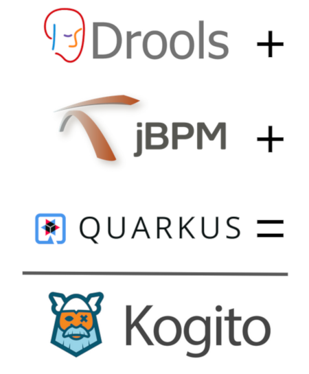

## Kogito
**Kogito** is the next generation of business automation platform focused on cloud-native development, deployment and execution.

## Quick Links
**Homepage:** http://kogito.kie.org

**Guides and Documentation:** https://kogito.kie.org/guides/

**JIRA Issues:** https://issues.jboss.org/projects/KOGITO

## Requirements
- [Maven](https://maven.apache.org/) 3.8.1 or later
- [Java](https://openjdk.java.net/install/) 11 or later (devel package)
- optional: Docker installation for running integration tests

## Getting Started
The [Kogito Examples repository](https://github.com/kiegroup/kogito-examples) module contains a number of examples that you can take a look at and try out yourself. Please take a look at the readme of each individual example for more details on how the example works and how to run it yourself (either locally or on Kubernetes).

## Guides
The official guides for Kogito can be found at our main website, these include guides for Quarkus and Spring Boot.

- [Kogito Guides](https://kogito.kie.org/guides/).

If you want to read more about Quarkus:

- [Quarkus - Getting Started](https://quarkus.io/get-started/) - Quarkus Getting Started guide
- [Quarkus - Using Kogito to add business automation capabilities to an application](https://quarkus.io/guides/kogito) - A simple quick start hosted on the Quarkus web site.

## Building and Contributing to Kogito
All contributions are welcome! Before you start please read the [contribution guide](CONTRIBUTING.md).

## Getting Help
### Issues
- Do you have a [minimal, reproducible example](https://stackoverflow.com/help/minimal-reproducible-example) for your issue?
  - If so, please open a Jira for it in the [Kogito project](https://issues.redhat.com/projects/KOGITO/summary) with the details of your issue and example.
- Are you encountering an issue but unsure of what is going on? 
  - Start a new conversation in the Kogito [Google Group](https://groups.google.com/g/kogito-development), or open a new thread in the [Kogito stream](https://kie.zulipchat.com/#narrow/stream/232676-kogito) of the KIE Zulip chat.
  - Please provide as much relevant information as you can as to what could be causing the issue, and our developers will help you figure out what's going wrong.

### Requests
- Do you have a feature/enhancement request?
  - Please open a new thread in the [Kogito stream](https://kie.zulipchat.com/#narrow/stream/232676-kogito) of the KIE Zulip chat to start a discussion there.
