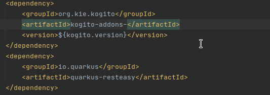

# Kogito Add-Ons

In this package you will find the Add-Ons modules that extend the Kogito Core capabilities. They add 
persistence, monitoring, messaging, and many other features to the Kogito service.

## Add-Ons Catalog

The following table lists all the add-ons, independent of runtime implementation, supported by the Kogito Community:

| Add-On Description     | Artifact ID                          | Since               |
|------------------------|--------------------------------------|---------------------|
| Human Task Predictions | kogito-addons-human-task-prediction-api | 0.7.0            |

### Quarkus Implementation

See the [Quarkus Add-Ons](../quarkus/addons) documentation.

### Spring Boot Implementation

See the [Spring Boot Add-Ons](../springboot/addons) documentation.

## Modules organization

At the root of this project you will find:

1. `common` - contains the core features for a specific add-on. They are not meant to be used in user's final projects,
   but as main libraries for runtimes implementations
2. `deprecated` - about to be deprecated modules in future versions

The add-ons for Quarkus/Spring Boot you will find in their own modules in the root of this repository:

1. [`quarkus/addons`](../quarkus/addons) - contains the add-ons for Quarkus. If your Kogito project is built with
   Quarkus, use the dependencies listed in this sub-module
2. [`springboot/addons`](../springboot/addons) - contains the add-ons for Spring Boot. These dependencies are meant to
   use only with Kogito projects built with Spring Boot

Inside each of these modules, you will find the add-ons organized by its capabilities.

If you don't find a specific capability in a given runtime module, it's because the runtime doesn't support the
capability yet. Please [open a JIRA](https://issues.redhat.com/projects/KOGITO/issues/)
or [start a thread on Zulip](https://kie.zulipchat.com/#)
if you're a looking for a specific capability implementation.

## How to use a Kogito Add-on

Generally speaking, the usage of an add-on is pretty straightforward, you just have to add the dependency to
your `pom.xml` file:

```xml

<dependencies>
  <dependency>
    <groupId>org.kie</groupId>
    <artifactId>kie-addons-quarkus-process-management</artifactId>
    <version>${kogito.version}</version>
  </dependency>
</dependencies>
```

> Replace `${kogito.version}` with the desired version

For specific usage, please check the documentation in each [add-on module](common).

Notice that **every** Kogito Add-on starts with `kogito-addons-` prefix. This facilitates your search using IDE:



In general, the add-on name is composed like `kogito-addons-{runtime}-{capability}-{implementation}`:

- `{runtime}` - can be either `quarkus` or `springboot`.
- `{capability}` - the capability of the add-on such as `persistence`, `eventing`, `cloudevents` and so forth. It's ok
  if your capability have a composite name like `jobs-management`.
- `{implementation}` - (optional) the specific implementation of the given capability. For example, `persistence` can
  have `mongodb` or `postgresql`. This is not a formality, since after the `{runtime}` prefix everything is related to
  the capability. It's more a way to differentiate the implementations.

The core add-ons don't have a `runtime` prefix either because they are the bases for the implementation by a runtime, or
they are a generic implementation that can work either on [Quarkus](../quarkus/addons) or [Spring Boot](../quarkus/addons).
Check the [listing above](#addons-catalog) of the add-ons to find out more.

## Creating a new Kogito Add-on

You can either add a brand-new capability to Kogito, or a new implementation for an already supported capability.

### Add a new Capability to Kogito

In this case, you will have to create a new capability from the scratch. To do that, be aware that you should have
knowledge of the Kogito engine internals. Then follow these steps:

1. Create a new sub-module under `common` with a meaningful name. This module can be a parent module if you foresee a
   complex scenario for your new add-on. See [`messaging`](common/messaging) as an example.
2. Do not use any dependencies from Quarkus or Spring Boot in `common` module. Your add-on must only have code to support
   your capability. New dependencies must be added to the [kogito-build](../kogito-build/kogito-build-parent) BOM.
3. Create the same capability under the `addons` module in the runtime module you wish to add support (
   [`quarkus`](../quarkus/addons) or [`springboot`](../springboot/addons)). You can give support to
   one add-on only. Make the reason for your decision clear and discuss this decision with the community.
4. If your capability can have multiple implementations, add at least one flavor under `{runtime}/addons/{capability}`
   module. See [`monitoring`](../quarkus/addons/monitoring) as an example
5. Document each top-level module with a `README.md` and make it clear what your add-on is capable to do
6. Create an example of usage in the [`kogito-examples`](https://github.com/kiegroup/kogito-examples) repository

### Add a new Capability Implementation to Kogito

Sometimes, a capability requires a specific implementation. For example, `persistence`. It can be implemented by many
persistence technologies that can have their specific details. Each implementation is handled differently based on
the runtimes supported by Kogito:

1. Start with the runtime you wish to add the implementation. Create a new sub-module
   under `{runtime}/addons/{capability}`
2. Try to code with the runtime in mind and leverage their libraries. For Quarkus, see
   the [Quarkus Guides](https://quarkus.io/guides/) page to figure how to interact with the given technology. Spring Boot
   also has a comprehensive list of [guides](https://spring.io/guides)
3. Document the implementation with a `README.md` and make it clear how to use it
4. Create an example of usage in the [`kogito-examples`](https://github.com/kiegroup/kogito-examples) repository

If you have questions, feel free to reach out to us at the [KIE Zulip Channel](https://kie.zulipchat.com/#).

## Deprecated Add-ons

Please refer to the [deprecated modules](deprecated/README.md) documentation for a list of deprecated add-ons. 
