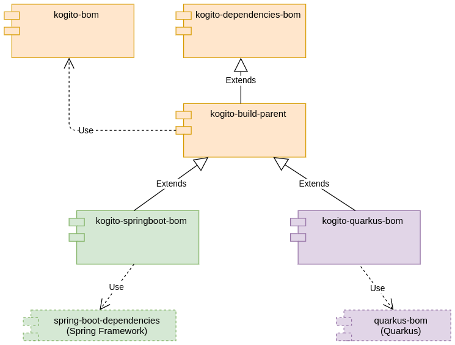

<!--
  Licensed to the Apache Software Foundation (ASF) under one
  or more contributor license agreements.  See the NOTICE file
  distributed with this work for additional information
  regarding copyright ownership.  The ASF licenses this file
  to you under the Apache License, Version 2.0 (the
  "License"); you may not use this file except in compliance
  with the License.  You may obtain a copy of the License at

    http://www.apache.org/licenses/LICENSE-2.0

  Unless required by applicable law or agreed to in writing,
  software distributed under the License is distributed on an
  "AS IS" BASIS, WITHOUT WARRANTIES OR CONDITIONS OF ANY
  KIND, either express or implied.  See the License for the
  specific language governing permissions and limitations
  under the License.
  -->

# Kogito BOMs Hierarchy and Usage

Each Kogito BOM descriptor has a specific usage. See the hierarchy diagram and read the sections below to know more.



## [Kogito BOM](../kogito-bom)

The `org.kie.kogito:kogito-bom` contains every library distributed and maintained by the Kogito project. It's where
every module of this project resides. It's used mostly internally by specific descriptors.

> **Maintainers:** Any new module should be added here.

> **Note:** End uses should check their specific runtime support for this BOM. Consider checking the section ["Creating a Maven project for a Kogito service"](https://docs.kogito.kie.org/latest/html_single/#proc-kogito-creating-project_kogito-creating-running)
in our documentation for more information.

### Usage

Add this section to your `pom.xml` file:

```xml

<dependencyManagement>
  <dependencies>
    <dependency>
      <groupId>org.kie.kogito</groupId>
      <artifactId>kogito-bom</artifactId>
      <version>${kogito.version}</version>
      <type>pom</type>
      <scope>import</scope>
    </dependency>
  </dependencies>
</dependencyManagement>
```

## [Kogito Dependencies BOM](kogito-dependencies-bom)

The `org.kie.kogito:kogito-dependencies-bom` contains every third-party library used by Kogito in a whole. **It's not
tied to a specific runtime**. Can communicate to external ecosystems the required third-party dependencies used by
Kogito.

> **Note**: End users should not use it directly in their projects.

## [Kogito Build No BOM Parent](kogito-build-no-bom-parent)

Main entry point for build specific configuration. Every plugin, profile, and any other build configuration should be
added here. Inherits the dependency configuration
from `org.kie.kogito:kogito-dependencies-bom`.

Does not import any Kogito specific BOM, this allows for better control over the Dependency Management for example
in case of Quarkus Platform.

For internal modules it is more convenient to inherit from **Kogito Build Parent** (below) which brings in the Dependency
Management of Kogito artifacts.

Direct usage of this module is for example in `org.kie.kogito.examples:kogito-examples`, where BOM imports are
handled explicitly.

> **Note**: End users should not use it directly in their projects.

## [Kogito Build Parent](kogito-build-parent)

Inherits the dependency configuration
from `org.kie.kogito:kogito-build-no-bom-parent` and on top of that imports `org.kie.kogito:kogito-bom`.

That means that every internal module inherits from it, because this parent project takes care of Dependency Management
as opposed to **Kogito Build No BOM Parent** (above).

> **Note**: End users should not use it directly in their projects.

## [Kogito Quarkus BOM](../quarkus/bom)

Inherits from `org.kie.kogito:kogito-build-parent` and imports the Quarkus BOM. Contains specific configuration and
dependency for internal modules targeting the Quarkus Runtime.

> **Note**: End users should not use it directly in their projects.

## [Kogito Spring Boot BOM](../springboot/bom)

Similarly to Kogito Quarkus BOM, this descriptor inherits from `org.kie.kogito:kogito-build-parent` and imports the
[Spring Boot dependencies BOM](https://docs.spring.io/spring-boot/docs/2.5.3/maven-plugin/reference/htmlsingle/#using.import)
. Contains specific configuration and dependencies for internal modules targeting the Spring Boot Runtime.

> **Note:** Users can import this descriptor to have all Kogito libraries and Spring Boot dependencies aligned.

### Usage

Add this section to your `pom.xml` file:

```xml

<dependencyManagement>
  <dependencies>
    <dependency>
      <groupId>org.kie.kogito</groupId>
      <artifactId>kogito-spring-boot-bom</artifactId>
      <version>${kogito.version}</version>
      <type>pom</type>
      <scope>import</scope>
    </dependency>
  </dependencies>
</dependencyManagement>
```

## FAQ

_**I'm building my Kogito application, which BOM should I use?**_

It depends on the runtime you chose. Kogito BOM should be your choice with the target platform descriptor. See the
section ["Creating a Maven project for a Kogito service"](https://docs.kogito.kie.org/latest/html_single/#proc-kogito-creating-project_kogito-creating-running)
of our docs to find out more.

_**I'm a contributor, which BOM should I use?**_

If you're developing for a specific runtime, add your dependencies to the respective runtime. Otherwise, add the
dependency to Kogito Dependencies BOM. If you need to add a new plugin or any build specifics, add this new
configuration to Kogito Build Parent BOM.
Read [this guide](https://github.com/kiegroup/droolsjbpm-build-bootstrap/blob/main/README.md#requirements-for-dependencies)
before adding a new dependency to **any** BOM. 
