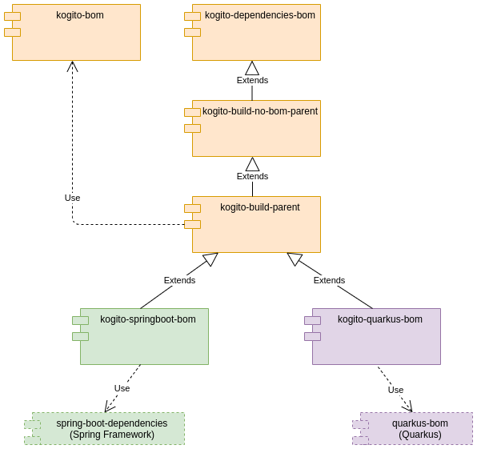

# Kogito BOMs Hierarchy and Usage

Each Kogito BOM descriptor has a specific usage. See the hierarchy diagram and read the sections below to know more.



## Kogito BOM

The `org.kie.kogito:kogito-bom` contains every library distributed and maintained by the Kogito project. It's where
every module of this project resides. It's used most internally by specifics descriptors. End users should not use it
directly in their projects.

Any new module should be added here.

## [Kogito Dependencies BOM](kogito-dependencies-bom)

The `org.kie.kogito:kogito-dependencies-bom` contains every third-party library used by Kogito in a whole. **It's not
tied to a specific runtime**. Can communicate to external ecosystems the required third-party dependencies used by
Kogito.

## [Kogito Build Parent BOM](kogito-build-parent)

Main entry point for build specific configuration. Every plugin, profile, and any other build configuration should be
added here. Imports `org.kie.kogito:kogito-bom` and inherit the dependency configuration
from `org.kie.kogito:kogito-dependencies-bom`. This means that every internal module inherits from it. End users should
not use it directly in their projects.

## [Kogito Quarkus BOM](../quarkus/bom)

Inherits from `org.kie.kogito:kogito-build-parent` and imports the Quarkus BOM. Contains specifics configuration and
dependency for internal modules targeting the Quarkus Runtime. **It's the end user BOM descriptor for Kogito Quarkus
projects**.

### Usage

Add this section to your `pom.xml` file:

```xml

<dependencyManagement>
  <dependencies>
    <dependency>
      <groupId>org.kie.kogito</groupId>
      <artifactId>kogito-quarkus-bom</artifactId>
      <version>${kogito.version}</version>
      <type>pom</type>
      <scope>import</scope>
    </dependency>
  </dependencies>
</dependencyManagement>
```

## [Kogito Spring Boot BOM](../springboot/bom)

Similarly to Kogito Quarkus BOM, this descriptor inherits from `org.kie.kogito:kogito-build-parent` and imports the
[Spring Boot dependencies BOM](https://docs.spring.io/spring-boot/docs/2.5.3/maven-plugin/reference/htmlsingle/#using.import)
. Contains specifics configuration and dependency for internal modules targeting the Spring Boot Runtime. **It's the end
user BOM descriptor for Kogito Spring Boot projects**.

### Usage

Add this section to your `pom.xml` file:

```xml

<dependencyManagement>
  <dependencies>
    <dependency>
      <groupId>org.kie.kogito</groupId>
      <artifactId>kogito-springboot-bom</artifactId>
      <version>${kogito.version}</version>
      <type>pom</type>
      <scope>import</scope>
    </dependency>
  </dependencies>
</dependencyManagement>
```

## FAQ

_**I'm building my Kogito application, which BOM should I use?**_

It depends on the runtime you chose. Kogito Quarkus or Spring Boot BOM should be your choice. See the
section ["Creating a Maven project for a Kogito service"](https://docs.jboss.org/kogito/release/latest/html_single/#proc-kogito-creating-project_kogito-creating-running)
of our docs to find out more.

_**I'm a contributor, which BOM should I use?**_

If you're developing for a specific runtime, add your dependencies to the respective runtime. Otherwise, add the
dependency to Kogito Dependencies BOM. If you need to add a new plugin or any build specifics, add this new
configuration to Kogito Build Parent BOM.
Read [this guide](https://github.com/kiegroup/droolsjbpm-build-bootstrap/blob/main/README.md#requirements-for-dependencies)
before adding a new dependency to **any** BOM. 
